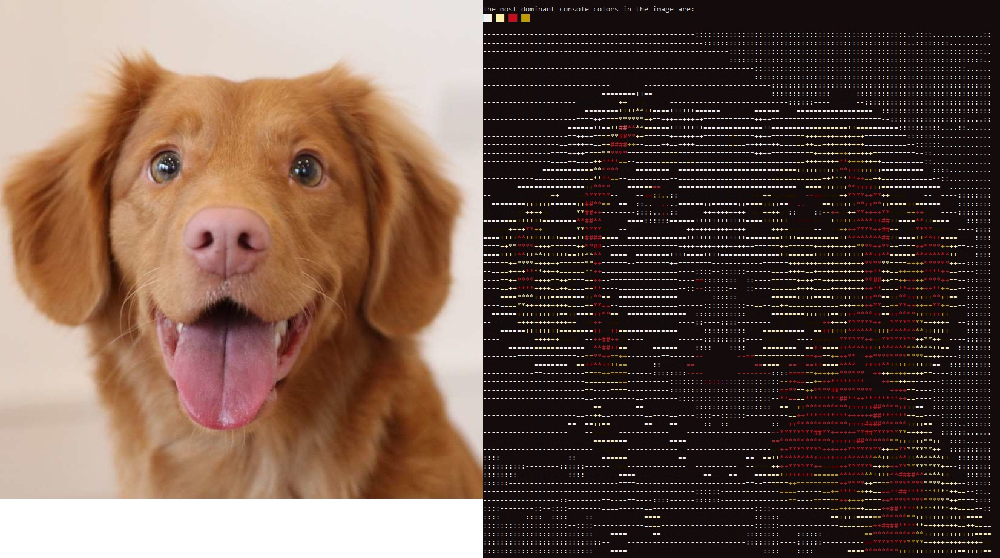

# BitmapASCII

Extends C#'s [Bitmap](https://learn.microsoft.com/en-us/dotnet/api/system.drawing.bitmap) class to add a [`PrintASCII()`](https://github.com/jackcarey/BitmapASCII/blob/main/ImgToANSIConsole/ASCIIPrint.cs) function that can be used in Windows console applications to render images as crude, colorful text.

The latest version is on the [releases page](https://github.com/jackcarey/BitmapASCII/releases).

## PrintASCII()

```
void PrintASCII(this Bitmap src, int minSide, bool fit = true,bool useLongArray=false)
```

### Parameters

- `minSide` - the minimum size of the image specified as a number of rows or columns. The smallest dimension of the image is used.
- `fit` - Should the image be resized to fit inside console window if `minSide` would overflow.
- `useLongArray` - Two character shading arrays are provided to fill in each cell. The short one is used by default. The long one uses more characters but you might prefer one style over the other.

## DominantConsoleColors()

```csharp
ConsoleColor[] DominantConsoleColors(this Bitmap src, int num = 0, bool useLong = false)
```

- `num` - the number of colors to return, default is all colors in descenting order.
- `useLongArray` - Two character shading arrays are provided to fill in each cell. The short one is used by default. The long one uses more characters but you might prefer one style over the other.

## DominantConsoleColor()

As above, but directly returns the most dominant `ConsoleColor`.

## Examples

```csharp
Bitmap bmp = new Bitmap(filePath);
bmp.PrintASCII();                  //print using default settings
bmp.PrintASCII(width);             //print at a desired width, but stay responsive
bmp.PrintASCII(width,false);       //print at a fixed width
bmp.PrintASCII(width, true, true); //print responsively and using the more detailed shading characters
ConsoleColor[] cols = bmp.DominantConsoleColors(3); //return an array of the three most dominant colors in the image
Console.ForegroundColor = bmp.DominantConsoleColor(); //set the console foreground color to match the image accent
```

